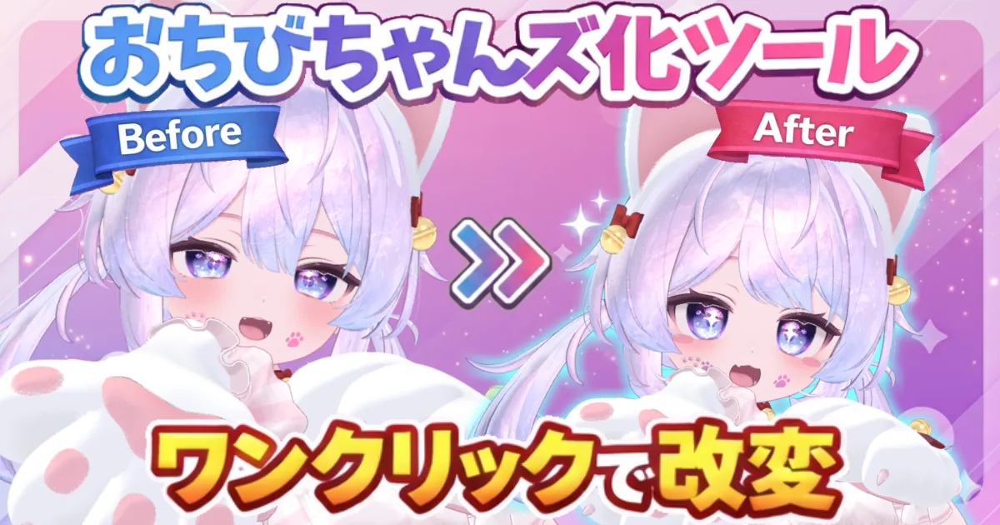

# おちびちゃんズ化ツール（Ochibi-chans Converter Tool）

VRChatアバターを **「おちびちゃんズ」向けに変換**する Unity Editor 拡張です。  
詳細な導入手順・使い方・対応アバター・トラブル対応は、以下の説明書サイトを参照してください。

- **メイン説明書（GitHub Pages）**  
  https://aramaa-vr.github.io/ochibi-chans-converter-tool/

## 利用前の注意（トラブル予防のため）

- 本ツールは **非公式（ファンメイド）** です。夕時茶屋様の公式ツールではありません。
- 本ツールの利用は **自己責任** です。利用前に Unity プロジェクトやアバターの **バックアップ** を推奨します。
- 利用前に **利用規約（VN3ライセンス）** を確認してください。  
  https://github.com/aramaa-vr/ochibi-chans-converter-tool/blob/master/LICENSE
- 依存ライブラリ等の表記は **Third Party Notices** を確認してください。  
  https://github.com/aramaa-vr/ochibi-chans-converter-tool/blob/master/THIRD_PARTY_NOTICES.md
- 公式リンク・規約の案内は `docs/about.md` も参照してください。  
  https://aramaa-vr.github.io/ochibi-chans-converter-tool/about/

## このリポジトリの位置づけ

- `Assets/Aramaa/OchibiChansConverterTool/` : VPM配布ソース
- `docs/` : 説明書サイト（Jekyll）
- `Tools/release/` : リリース運用スクリプト

> このREADMEは入口案内です。  
> 実際の利用情報はメイン説明書を正としてください。

## 開発者向け情報

- リリース手順・運用コマンド: `Tools/release/README.md`
- docs のローカル表示確認: `docs/README.md`
